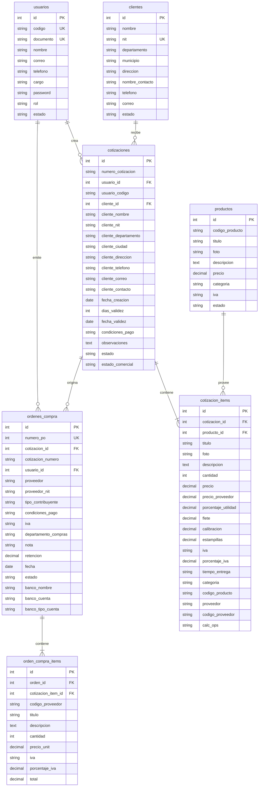
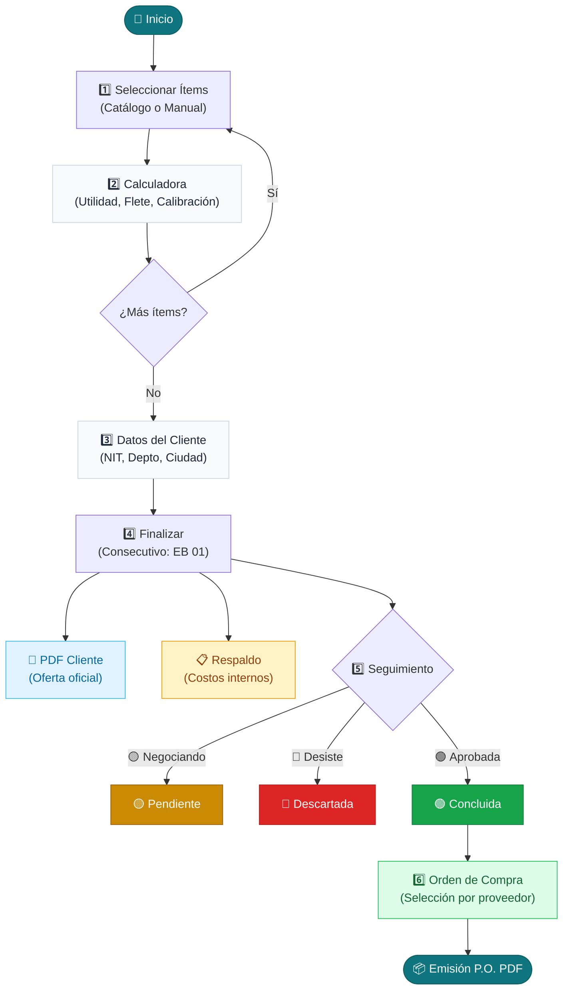

# 🏗️ Arquitectura y Componentes del Sistema Impobiomedical

**Versión:** 2.7.0  
**Fecha:** Septiembre 2026  
**Tecnología:** PHP 8.2 (PDO, MVC, Arquitectura Modular) · MariaDB / MySQL 8.0 · Vanilla CSS (SMACSS/ITCSS en `css/modules/`) · DomPDF · PHPUnit 10

---

## 📑 Tabla de Contenidos

1. [Resumen del Sistema](#1-resumen-del-sistema)
2. [Diagrama de Componentes y Capas (Arquitectura General)](#2-diagrama-de-componentes-y-capas-arquitectura-general)
3. [Matriz de Responsabilidades (Principios SOLID)](#3-matriz-de-responsabilidades-principios-solid)
4. [Estructura Completa de Directorios](#4-estructura-completa-de-directorios)
5. [Esquema de Base de Datos y Modelo de Datos](#5-esquema-de-base-de-datos-y-modelo-de-datos)
6. [Módulos del Sistema y Controladores](#6-módulos-del-sistema-y-controladores)
7. [Flujo Comercial Completo](#7-flujo-comercial-completo)
8. [Arquitectura de Estilos Modularizada (`css/`)](#8-arquitectura-de-estilos-modularizada-css)
9. [Seguridad y Protección de Capas](#9-seguridad-y-protección-de-capas)
10. [Generación de Documentos PDF y Exportaciones](#10-generación-de-documentos-pdf-y-exportaciones)
11. [Variables de Sesión y Control de Estado](#11-variables-de-sesión-y-control-de-estado)
12. [Suite de Pruebas Automatizadas (PHPUnit)](#12-suite-de-pruebas-automatizadas-phpunit)

---

## 1. Resumen del Sistema

El **Sistema Impobiomedical** es una plataforma web especializada para la gestión comercial y técnica de equipos, insumos y servicios biomédicos para **Impobiomedical — Soluciones y Servicios de Tecnología Biomédica**. 

Centraliza el ciclo comercial completo:
- Creación de cotizaciones dinámicas con cálculo automatizado de márgenes de utilidad, fletes, calibración metrológica e impuestos.
- Emisión de documentos PDF oficiales para entidades de salud (hospitales, clínicas, laboratorios y médicos independientes).
- Control de estados comerciales (`pendiente`, `concluida`, `descartada`) con actualización reactiva en tiempo real vía AJAX.
- Generación de órdenes de compra (P.O. - Purchase Orders) por proveedor seleccionado con navegación por pestañas (*Pendientes* y *Completadas*) y exportación selectiva a PDF y Excel.
- Hojas internas de respaldo confidencial de costos de proveedores.
- Directorio de entidades de salud y catálogo médico con almacenamiento sanitizado de fotografías.
- Panel analítico con indicadores clave de rendimiento (KPIs), gráfico mensual comparativo y reportes ejecutivos.

---

## 2. Diagrama de Componentes y Capas (Arquitectura General)


### Patrón de Enrutamiento Frontal:
| Módulo | Acción | Ruta | Propósito |
|---|---|---|---|
| Autenticación | Login | `/?module=` | Pantalla de inicio de sesión segura |
| Panel | Dashboard | `/?module=panel` | KPIs y accesos directos rápidos |
| Cotizaciones | Crear | `/?module=cotizaciones&action=crear&nueva=1` | Cotizador dinámico y calculadora |
| Cotizaciones | Finalizar | `/?module=cotizaciones&action=finalizar` | Cierre de cotización y datos de cliente |
| Cotizaciones | Consultar | `/?module=cotizaciones&action=consultar` | Tabla de cotizaciones y cambio de estado AJAX |
| Cotizaciones | PDF | `/?module=cotizaciones&action=generar_pdf&ver=EB01` | Visor / descarga de PDF oficial |
| Cotizaciones | Respaldo | `/?module=cotizaciones&action=ver_respaldo&numero=EB01` | Hoja confidencial de costos de proveedores |
| Órdenes | Consultar | `/?module=ordenes&action=consultar` | Listado de órdenes por pestañas (Pendientes / Completadas) |
| Órdenes | Crear P.O. | `/?module=ordenes&action=seleccionar_items&cotizacion=EB01` | Generar orden para un proveedor desde cotización |
| Órdenes | **Orden Directa** | `/?module=ordenes&action=crear_directa` | **Nueva** — Generar P.O. sin cotización previa (compra directa) |
| Productos | Listar | `/?module=productos` | Catálogo médico y subida de imágenes |
| Clientes | Listar | `/?module=clientes` | Directorio de entidades de salud |
| Usuarios | Listar | `/?module=usuarios` | Gestión de cuentas de asesores y roles |
| Estadísticas | Reportes | `/?module=estadisticas` | Métricas y gráficos comparativos consolidados |

---

## 3. Matriz de Responsabilidades (Principios SOLID)

| Componente | Capa | Principio SOLID | Responsabilidad Principal |
|---|---|:---:|---|
| [index.php](file:///c:/xampp/htdocs/SistemaImpobiomedical/index.php) | Core | **OCP** | Front Controller centralizado; valida rutas y emite cabeceras de seguridad HTTP. |
| [seguridad.php](file:///c:/xampp/htdocs/SistemaImpobiomedical/config/seguridad.php) | Core | **SRP** | Manejo de sesiones blindadas, tokens CSRF, rate limiting, sanitización y escape XSS. |
| [conexion.php](file:///c:/xampp/htdocs/SistemaImpobiomedical/config/conexion.php) | Persistencia | **Singleton** | Conexión única PDO con `ERRMODE_EXCEPTION` y emulación deshabilitada. |
| [RepositoryInterface.php](file:///c:/xampp/htdocs/SistemaImpobiomedical/app/contracts/RepositoryInterface.php) | Contratos | **ISP** | Contrato base estandarizado para operaciones CRUD (`listar`, `contar`, `buscarPorId`, `eliminar`). |
| [CotizacionController.php](file:///c:/xampp/htdocs/SistemaImpobiomedical/app/controllers/CotizacionController.php) | Controlador | **SRP** | Orquesta el flujo de cotizaciones, creación de borradores y versiones. |
| [FinalizarCotizacionService.php](file:///c:/xampp/htdocs/SistemaImpobiomedical/app/services/FinalizarCotizacionService.php) | Servicio | **SRP** | Generación de números consecutivos (`EB 01`, `EB 01_01`) y cierre de cotizaciones. |
| [ItemCotizacionService.php](file:///c:/xampp/htdocs/SistemaImpobiomedical/app/services/ItemCotizacionService.php) | Servicio | **SRP** | Algoritmo de cálculo dinámico de utilidades, fletes, calibración, estampillas e IVA. |
| [OrdenCompraController.php](file:///c:/xampp/htdocs/SistemaImpobiomedical/app/controllers/OrdenCompraController.php) | Controlador | **SRP** | Emisión y control de órdenes, navegación por pestañas y exportación selectiva a PDF/Excel. |
| [FileUploadService.php](file:///c:/xampp/htdocs/SistemaImpobiomedical/app/services/FileUploadService.php) | Servicio | **SRP** | Validación de tipos MIME reales, tamaños máximos y nombres únicos de archivos. |
| [Modelos PDO](file:///c:/xampp/htdocs/SistemaImpobiomedical/app/models/) | Persistencia | **ISP / DIP** | Acceso a datos con parámetros nombrados, eliminando cualquier vector de SQL Injection e implementando `RepositoryInterface`. |

---

## 4. Estructura Completa de Directorios

```text
SistemaImpobiomedical/
├── app/
│   ├── contracts/              # Interfaces y contratos del sistema (SOLID ISP)
│   │   └── RepositoryInterface.php
│   │
│   ├── controllers/            # Controladores del sistema (MVC)
│   │   ├── AuthController.php
│   │   ├── ClienteController.php
│   │   ├── CotizacionController.php
│   │   ├── EstadisticaController.php
│   │   ├── OrdenCompraController.php
│   │   ├── PanelController.php
│   │   ├── ProductoController.php
│   │   └── UsuarioController.php
│   │
│   ├── models/                 # Modelos con persistencia PDO y RepositoryInterface
│   │   ├── ClienteModel.php
│   │   ├── CotizacionModel.php
│   │   ├── EstadisticaModel.php
│   │   ├── OrdenCompraModel.php
│   │   ├── ProductoModel.php
│   │   └── UsuarioModel.php
│   │
│   ├── services/               # Lógica de negocio y utilidades desacopladas (SOLID SRP)
│   │   ├── FileUploadService.php
│   │   ├── FinalizarCotizacionService.php
│   │   └── ItemCotizacionService.php
│   │
│   └── views/                  # Vistas modulares (HTML + PHP puro)
│       ├── auth/               # Login y cambio de credenciales
│       ├── clientes/           # Gestión y modales de clientes
│       ├── cotizaciones/       # Cotizador, finalizar, consultar, respaldo y PDF
│       ├── estadisticas/       # Métricas y reporte consolidado
│       ├── layout/             # Header, menú lateral, topbar, paginación y footer
│       ├── ordenes/            # Consultar, pestañas, generar P.O. y exportar Excel
│       ├── panel/              # Dashboard principal
│       ├── productos/          # Catálogo médico y exportación PDF con imágenes
│       └── usuarios/           # Gestión de asesores y restablecimiento de claves
│
├── config/
│   ├── .env.example            # Plantilla de variables de entorno
│   ├── EnvLoader.php           # Cargador seguro de configuración .env
│   ├── conexion.php            # Singleton PDO con manejo seguro de excepciones
│   └── seguridad.php           # Biblioteca central de funciones de seguridad
│
├── css/
│   ├── estilos.css             # Entry point de la arquitectura CSS
│   └── modules/                # 7 submódulos SMACSS/ITCSS
│       ├── auth.css            # Estilos de login
│       ├── base.css            # Reset, tipografías y canvas
│       ├── components.css      # Botones, tablas, badges y modales
│       ├── forms.css           # Formularios, inputs y selects
│       ├── layout.css          # Sidebar, topbar y grillas principales
│       ├── responsive.css      # Media queries adaptables
│       └── variables.css       # Tokens, paleta de colores y transiciones
│
├── docs/                       # Documentación técnica y funcional exhaustiva
│   ├── ARQUITECTURA_Y_COMPONENTES.md
│   ├── CHANGELOG.md
│   ├── CONTRIBUTING.md
│   ├── ESPECIFICACION_REQUISITOS.md
│   ├── MANUAL_USUARIO.md
│   ├── PLAN_DE_IMPLEMENTACION.md
│   └── documentacion-tecnica.md
│
├── public/
│   └── js/
│       └── script.js           # Toggle de menú, confirmaciones y anti-doble envío
│
├── tests/
│   └── Unit/                   # Suite de pruebas unitarias PHPUnit 10
│       ├── CalculosComercialesTest.php
│       └── SeguridadTest.php
│
├── uploads/                    # Almacenamiento persistente de imágenes sanitizadas
├── .github/workflows/ci.yml    # Pipeline de Integración Continua (CI)
├── BD.txt                      # Script SQL DDL de la base de datos
├── Dockerfile                  # Imagen multi-stage PHP 8.2
├── docker-compose.yml          # Orquestación de servicios y volúmenes
└── deploy.sh                   # Script automatizado de actualización sin caída
```

---

## 5. Esquema de Base de Datos y Modelo de Datos

**Motor:** MySQL 8.0+ / MariaDB 10.4+  
**Collation:** `utf8mb4_unicode_ci`  
**Storage Engine:** `InnoDB` (Soporte transaccional y claves foráneas)



---

## 6. Módulos del Sistema y Controladores

### 6.1 Autenticación (`AuthController.php`)
- **Login Seguro:** Valida documento y contraseña contra `password_verify()`.
- **Regeneración de ID de Sesión:** Ejecuta `regenerar_sesion()` tras login exitoso para prevenir ataques de Session Fixation.
- **Sugerencia de Cambio de Contraseña:** Detecta si el usuario ingresó con su documento como clave y activa un modal no invasivo para actualizarla.
- **Protección Fuerza Bruta:** Rate Limiting estricto de máximo 5 intentos fallidos cada 5 minutos.

### 6.2 Dashboard Principal (`PanelController.php`)
- **Métricas:** Conteo dinámico de cotizaciones totales, cotizaciones del mes (por asesor o global para admin), clientes activos y catálogo de productos.
- **Accesos Directos:** Botones de acción rápida adaptados por rol.

### 6.3 Cotizador y Negociaciones (`CotizacionController.php`)
- **Manejo de Borrador Activo:** Sesión `$_SESSION['cotizacion_id']` para construir la cotización paso a paso sin perder datos.
- **Revisiones Numéricas:** Si se modifica una cotización existente, el sistema genera sufijos automáticos (`_01`, `_02`) conservando el historial.
- **Actualización de Estado Comercial:** Endpoint `cambiar_estado` protegido con `verificar_admin()`, token CSRF y rate limit con respuesta JSON asíncrona y reactividad inmediata en el botón de órdenes.

### 6.4 Catálogo de Productos (`ProductoController.php`)
- **Carga de Fotografías:** Integrado con `FileUploadService` para validación de tipo MIME real (`finfo`), generación de nombres únicos (`bin2hex(random_bytes(16))`) y control de tamaño.
- **Exportación PDF:** Genera catálogo estructurado en dos columnas con miniaturas e imágenes optimizadas.

### 6.5 Órdenes de Compra (`OrdenCompraController.php`)
- **Aislamiento por Proveedor:** Agrupa los ítems cotizados y permite generar la Orden de Compra (P.O.) únicamente con los productos del proveedor seleccionado.
- **Bloqueo Inteligente:** Deshabilita tanto en frontend como en backend la generación de órdenes sobre cotizaciones que hayan sido marcadas como `concluida` o `descartada`.
- **Pestañas de Estado y AJAX:** Pestañas visuales para 🟡 *Pendientes* y 🟢 *Completadas* con endpoint reactivo `cambiar_estado` protegido con CSRF y Rate Limit.
- **Selección Granular y Reportes:** Selección por casillas de verificación individuales y globales para exportación selectiva a **PDF** y **Excel tabular (.xls)** con sumatorias automáticas y optimización de consultas SQL en bloque.
- **Cálculo de Retenciones:** Aplica retención en la fuente y discriminación de IVA para contabilidad.

### 6.6 Directorio de Clientes (`ClienteController.php`)
- **Autocompletado en Vivo:** Endpoint AJAX para búsqueda instantánea por NIT o Razón Social.
- **Ubicación Geográfica:** Almacena departamento y municipio de cada entidad de salud.

### 6.7 Gestión de Usuarios (`UsuarioController.php`)
- **Control de Asesores:** Asigna código de cotización de 2 a 3 letras único por asesor (ej. `EB`).
- **Reseteo Administrativo:** Restablece contraseñas al número de documento con un solo clic.

---

## 7. Flujo Comercial Completo

El siguiente diagrama resume el ciclo de vida de una negociación desde la creación de la oferta hasta la compra a proveedores y su seguimiento:



---

## 8. Arquitectura de Estilos Modularizada (`css/`)

La interfaz gráfica sigue una arquitectura **SMACSS/ITCSS** dividida en 7 submódulos:

```
css/
├── estilos.css               # Maestro (@imports)
└── modules/
    ├── variables.css         # Paleta de colores médica (Teal/Navy/Cyan), tokens y @keyframes
    ├── base.css              # Reset CSS, html/body, canvas de partículas y overlays
    ├── layout.css            # Sidebar / Menú lateral, Topbar y Contenedores principales
    ├── components.css        # Tarjetas, Botones, Tablas, Modales, Badges y Calculadora
    ├── forms.css             # Formularios globales, Inputs y Buscadores dinámicos
    ├── auth.css              # Pantalla de Login, Branding y Formularios de autenticación
    └── responsive.css        # Media queries y adaptabilidad para móviles y tablets
```

---

## 9. Seguridad y Protección de Capas

| Vector de Ataque | Mecanismo de Defensa Implementado | Ubicación en Código |
|---|---|---|
| **Inyección SQL** | Sentencias preparadas PDO con parámetros obligatorios `:param`. | Todos los archivos en `app/models/` |
| **Cross-Site Scripting (XSS)** | Escape estricto con `htmlspecialchars(..., ENT_QUOTES, 'UTF-8')` y sanitización. | `config/seguridad.php` y vistas |
| **CSRF (Cross-Site Request Forgery)** | Tokens criptográficos aleatorios `random_bytes(32)` validados con `hash_equals()` en todas las peticiones POST/DELETE. | `config/seguridad.php` |
| **Clickjacking** | Cabecera HTTP `X-Frame-Options: SAMEORIGIN`. | `index.php` |
| **MIME-Sniffing** | Cabecera HTTP `X-Content-Type-Options: nosniff`. | `index.php` |
| **Content Security Policy (CSP)** | Directiva estricta restringiendo scripts y estilos únicamente al origen y CDNs autorizados. | `index.php` |
| **Ataques de Fuerza Bruta** | Rate limiting en memoria con ventana de tiempo fija (`verificar_rate_limit()`). | `config/seguridad.php` |
| **Falsificación de Archivos** | Verificación de extensión en lista blanca y validación de cabecera binaria MIME (`finfo_open`). | `app/services/FileUploadService.php` |
| **Session Hijacking** | Cookies con flags `HttpOnly`, `SameSite=Strict`, `Secure` y expiración por inactividad a 3600s. | `config/seguridad.php` |

---

## 10. Generación de Documentos PDF y Exportaciones

El sistema utiliza la biblioteca **DomPDF** optimizada para el entorno de producción:

1. **Cotización Oficial para Clientes (`app/views/cotizaciones/generar_pdf.php`)**:
   - Encabezado institucional con logo corporativo de Impobiomedical.
   - Datos completos de la entidad y ciudad.
   - Tabla de productos cotizados con especificaciones técnicas, precios unitarios, subtotales, IVA discriminado y condiciones comerciales.
2. **Exportación de Cotizaciones a Excel (`app/views/cotizaciones/exportar_excel.php`)**:
   - Generación ligera (.xls) sin imágenes orientada a máxima velocidad de descarga y compatibilidad analítica.
   - Detalle estructurado de ítems, precios unitarios, IVA calculado y totales comerciales.
3. **Hoja de Respaldo de Proveedores (`app/views/cotizaciones/respaldo.php`)**:
   - Documento interno confidencial con costos de proveedor, desglose de márgenes por ítem y utilidad bruta proyectada.
4. **Orden de Compra (`app/views/ordenes/`)**:
   - Documento P.O. formal con datos bancarios del proveedor y desglose tributario (incluyendo IVA opcional en flete).
   - Exportación dual: **PDF oficial** y **Excel (.xls)** con sumatoria contable.
5. **Catálogo Médico con Imágenes (`app/views/productos/pdf.php`)**:
   - Renderizado optimizado de fotografías médicas con reglas `page-break-inside: avoid`, `@ini_set('memory_limit', '256M')` y timeout extendido a 120s.

---

## 11. Variables de Sesión y Control de Estado

| Variable | Tipo | Propósito |
|---|---|---|
| `$_SESSION['usuario_id']` | `int` | ID del usuario autenticado en la base de datos |
| `$_SESSION['usuario_nombre']` | `string` | Nombre completo del usuario |
| `$_SESSION['usuario_codigo']` | `string` | Código de asesor (ej. `EB`, `HM`) |
| `$_SESSION['usuario_cargo']` | `string` | Cargo del usuario |
| `$_SESSION['rol']` | `string` | Nivel de permisos (`admin` o `usuario`) |
| `$_SESSION['csrf_token']` | `string` | Token de seguridad activo |
| `$_SESSION['cotizacion_id']` | `int` | ID de la cotización en borrador en construcción |
| `$_SESSION['cotizacion_revision_de']` | `string` | Número base de cotización que se está modificando |
| `$_SESSION['orden_tab']` | `string` | Pestaña activa en órdenes de compra (`pendientes` o `completadas`) |
| `$_SESSION['LAST_ACTIVITY']` | `int` | Timestamp de última interacción para expiración automática |

---

## 12. Suite de Pruebas Automatizadas (PHPUnit)

El proyecto cuenta con una suite de pruebas unitarias configurada en `phpunit.xml`:

```bash
# Ejecutar todas las pruebas unitarias
./vendor/bin/phpunit
```

### Cobertura de Pruebas:
- **`CalculosCotizacionTest.php`**: Valida cálculos de margen de utilidad, adición de fletes, calibración, estampillas, discriminación de IVA (19% y 0%), consecutivos con código de asesor y sufijos de revisión (`EB 01_01`).
- **`SeguridadTest.php`**: Valida generación y rotación de tokens CSRF, sanitización contra inyecciones XSS, cifrado `bcrypt`, validadores de email y rate limiting.
- **`OrdenCompraCalculosTest.php`**: Valida la liquidación contable de órdenes de compra con IVA y retenciones en la fuente, el agrupamiento en bloque de ítems (eliminación de N+1) y estados válidos.
- **`FileUploadServiceTest.php`**: Valida la generación criptográfica de nombres únicos de archivos y la lista blanca de extensiones de imágenes permitidas frente a extensiones peligrosas.
- **`ValidacionesNegocioTest.php`**: Valida las reglas de bloqueo en backend para emisión de órdenes según el estado de la cotización y la integridad del JSON de operaciones dinámicas (`calc_ops`).

