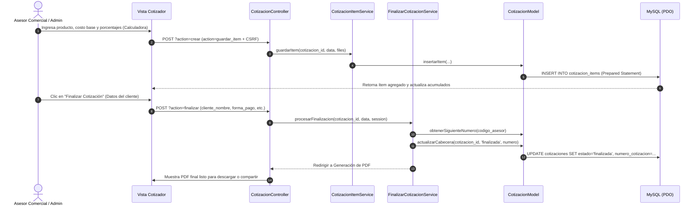

# 🏗️ Arquitectura y Componentes del Sistema Impobiomedical

Este documento describe formalmente la arquitectura de software, los patrones de diseño, las capas del sistema, el flujo de datos y los controles de seguridad implementados en el **Sistema Impobiomedical** (Gestión de Catálogo Médico, Cotizaciones Dinámicas y Órdenes de Compra).

---

## 1. Diagrama de Componentes y Capas

```mermaid
graph TB
    subgraph CLIENT["💻 Clientes & Navegadores"]
        direction TB
        UI_LOGIN["🔐 Vista de Login\napp/views/auth/login.php"]
        UI_DASH["📊 Dashboard Principal\napp/views/panel/index.php"]
        UI_COT["📝 Cotizador Dinámico\n(Calculadora de Utilidades & Ganancias)\napp/views/cotizaciones/"]
        UI_ORD["📦 Gestión de Órdenes de Compra (P.O.)\napp/views/ordenes/"]
        UI_PROD["🩺 Catálogo de Productos Médicos\napp/views/productos/"]
        UI_CLI["🏢 Directorio de Clientes & Entidades\napp/views/clientes/"]
        UI_USR["👥 Administración de Usuarios\napp/views/usuarios/"]
        UI_EST["📈 Estadísticas y Métricas\napp/views/estadisticas/"]
    end

    subgraph ENTRY["🚪 Capa de Entrada & Seguridad HTTP"]
        ROUTER["🔀 Front Controller (Router Central)\nindex.php (?module=...&action=...)"]
        SEC_HEADERS["🛡️ Security Headers Engine\n(CSP, X-Frame-Options, HSTS, No-Sniff)"]
        AUTH_GUARD["🔒 Verificación de Sesión & Roles\n(verificar_autenticacion / verificar_admin)"]
        CSRF_GUARD["🔑 CSRF Token Guard & Rate Limiter\n(verificar_token_csrf / verificar_rate_limit)"]
    end

    subgraph CONTROLLERS["🎮 Capa de Controladores (MVC)"]
        direction TB
        CTRL_AUTH["AuthController\nInicio y Cierre de Sesión"]
        CTRL_PANEL["PanelController\nKPIs y Accesos Rápidos"]
        CTRL_COT["CotizacionController\nFlujo de Cotizaciones y Versiones"]
        CTRL_ORD["OrdenCompraController\nGeneración de P.O. y Selección de Ítems"]
        CTRL_PROD["ProductoController\nCatálogo y Paginación"]
        CTRL_CLI["ClienteController\nDirectorio y Búsqueda AJAX"]
        CTRL_USR["UsuarioController\nGestión de Usuarios y Roles"]
        CTRL_EST["EstadisticaController\nReportes y Filtros Avanzados"]
    end

    subgraph SERVICES["🔌 Capa de Servicios Especializados"]
        SRV_FINAL["FinalizarCotizacionService\nConsecutivos y Asignación Comercial"]
        SRV_ITEM["CotizacionItemService\nCálculo de Utilidad, Fletes y Calibración"]
        SRV_FILE["FileUploadService\nSanitización y Validación MIME de Imágenes"]
        SRV_PDF["DomPDF Engine\nGeneración de PDFs Profesionales"]
    end

    subgraph DATA["🗄️ Capa de Persistencia (Modelos PDO)"]
        direction TB
        DB_CONN["🔒 conexion.php (PDO Singleton)\nSentencias Preparadas & Transacciones"]
        MODEL_COT["CotizacionModel"]
        MODEL_ORD["OrdenCompraModel"]
        MODEL_PROD["ProductoModel"]
        MODEL_CLI["ClienteModel"]
        MODEL_USR["UsuarioModel"]
        MODEL_EST["EstadisticaModel"]
    end

    subgraph DATABASE ["🛢️ Base de Datos Relacional (MySQL 8.0+ / MariaDB)"]
        direction TB
        TBL_USUARIOS["usuarios"]
        TBL_CLIENTES["clientes"]
        TBL_PRODUCTOS["productos"]
        TBL_COTIZACIONES["cotizaciones"]
        TBL_ITEMS_COT["cotizacion_items"]
        TBL_ORDENES["ordenes_compra"]
        TBL_ITEMS_ORD["orden_compra_items"]
    end

    %% Relaciones
    CLIENT --> ROUTER
    ROUTER --> SEC_HEADERS
    SEC_HEADERS --> AUTH_GUARD
    AUTH_GUARD --> CSRF_GUARD
    CSRF_GUARD --> CONTROLLERS

    CTRL_COT --> SRV_FINAL
    CTRL_COT --> SRV_ITEM
    CTRL_COT --> SRV_PDF
    CTRL_ORD --> SRV_PDF
    CTRL_PROD --> SRV_FILE

    CONTROLLERS --> DATA
    DATA --> DB_CONN
    DB_CONN --> DATABASE
```



---

## 2. Matriz de Responsabilidades (Principios SOLID)

| Componente | Capa | Principio SOLID | Responsabilidad Principal |
|---|---|:---:|---|
| [index.php](file:///c:/xampp/htdocs/SistemaImpobiomedical/index.php) | Core | **OCP** | Front Controller centralizado; valida rutas y emite cabeceras de seguridad HTTP. |
| [seguridad.php](file:///c:/xampp/htdocs/SistemaImpobiomedical/config/seguridad.php) | Core | **SRP** | Manejo de sesiones blindadas, tokens CSRF, rate limiting, sanitización y escape XSS. |
| [conexion.php](file:///c:/xampp/htdocs/SistemaImpobiomedical/config/conexion.php) | Persistencia | **Singleton** | Conexión única PDO con `ERRMODE_EXCEPTION` y emulación deshabilitada. |
| [CotizacionController.php](file:///c:/xampp/htdocs/SistemaImpobiomedical/app/controllers/CotizacionController.php) | Controlador | **SRP** | Orquesta el flujo de cotizaciones, creación de borradores y versiones. |
| [FinalizarCotizacionService.php](file:///c:/xampp/htdocs/SistemaImpobiomedical/app/services/FinalizarCotizacionService.php) | Servicio | **SRP** | Generación de números consecutivos (`EB 01`, `EB 01_01`) y cierre de cotizaciones. |
| [CotizacionItemService.php](file:///c:/xampp/htdocs/SistemaImpobiomedical/app/services/CotizacionItemService.php) | Servicio | **SRP** | Algoritmo de cálculo dinámico de utilidades, fletes, calibración, estampillas e IVA. |
| [FileUploadService.php](file:///c:/xampp/htdocs/SistemaImpobiomedical/app/services/FileUploadService.php) | Servicio | **SRP** | Validación de tipos MIME reales, tamaños máximos y nombres únicos de archivos. |
| [Modelos PDO](file:///c:/xampp/htdocs/SistemaImpobiomedical/app/models/) | Persistencia | **DIP** | Acceso a datos con parámetros nombrados, eliminando cualquier vector de SQL Injection. |

---

## 3. Flujo de Datos del Cotizador y Órdenes de Compra



---

## 4. Arquitectura de Estilos Modularizada (`css/`)

La interfaz gráfica sigue una arquitectura **SMACSS/ITCSS** dividida en 7 submódulos:

```
css/
├── estilos.css               # Maestro (@imports)
└── modules/
    ├── variables.css         # Paleta de colores médica (Teal/Navy/Cyan), tokens y @keyframes
    ├── base.css              # Reset CSS, html/body, canvas de partículas y overlays
    ├── layout.css            # Sidebar / Menú lateral, Topbar y Contenedores principales
    ├── components.css        # Tarjetas, Botones, Tablas, Modales, Badges y Calculadora
    ├── forms.css             # Formularios globales, Inputs y Buscadores dinámicos
    ├── auth.css              # Pantalla de Login, Branding y Formularios de autenticación
    └── responsive.css        # Media queries y adaptabilidad para móviles y tablets
```

---

## 5. Controles de Seguridad de Nivel Empresarial

1. **Protección contra Inyecciones SQL:** 100% de las consultas utilizan `PDO::prepare()` con parámetros nombrados `:param`.
2. **Protección contra CSRF (Cross-Site Request Forgery):** Tokens criptográficos `bin2hex(random_bytes(32))` verificados en cada petición POST y DELETE.
3. **Protección contra XSS (Cross-Site Scripting):** Escape universal de salidas HTML mediante `htmlspecialchars(..., ENT_QUOTES | ENT_SUBSTITUTE, 'UTF-8')`.
4. **Cabeceras HTTP de Seguridad:**
   * `X-Frame-Options: SAMEORIGIN` (Anti-Clickjacking).
   * `X-Content-Type-Options: nosniff` (Anti-MIME Sniffing).
   * `Strict-Transport-Security` (HSTS para HTTPS).
   * `Content-Security-Policy` restrictivo.
5. **Protección Anti-Doble Envío:** Bloqueo interactivo de botones submit con feedback visual para evitar duplicados en conexiones lentas.
6. **Almacenamiento Seguro de Contraseñas:** Algoritmo nativo `PASSWORD_BCRYPT` (`password_hash` y `password_verify`).
7. **Rate Limiting en Memoria de Sesión:** Limitación de solicitudes en endpoints sensibles (login, creación de cotizaciones, reseteo de claves).
