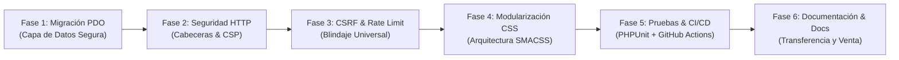

# 📋 Plan de Implementación y Evolución Técnica — Sistema Impobiomedical

Este documento recopila las fases estratégicas de modernización, refactorización arquitectónica, seguridad y aseguramiento de calidad ejecutadas en **Sistema Impobiomedical**.

---

## 🗺️ Fases del Proyecto

---

### Fase 1: Migración Completa de Base de Datos a PDO
* **Problema previo:** El sistema utilizaba `mysqli` con sentencias preparadas y llamadas dispersas.
* **Solución aplicada:**
  * Refactorización de `config/conexion.php` con singleton `PDO` y `ERRMODE_EXCEPTION`.
  * Migración de los 6 modelos del sistema (`UsuarioModel`, `ClienteModel`, `ProductoModel`, `EstadisticaModel`, `CotizacionModel`, `OrdenCompraModel`) a sintaxis PDO con parámetros nombrados.
  * Corrección crítica de SQL Injection en `EstadisticaModel`.

### Fase 2: Endurecimiento de Seguridad HTTP (Security Headers)
* Emisión estricta de cabeceras en `index.php`:
  * `X-Frame-Options: SAMEORIGIN` (Anti-Clickjacking).
  * `X-Content-Type-Options: nosniff` (Anti-MIME Sniffing).
  * `Referrer-Policy: strict-origin-when-cross-origin`.
  * `Permissions-Policy: camera=(), microphone=(), geolocation=()`.
  * `Strict-Transport-Security: max-age=31536000; includeSubDomains`.
  * `Content-Security-Policy` básico y compatible.

### Fase 3: Auditoría y Blindaje CSRF Universal & Anti-Doble Envío
* Validación estricta de `csrf_token` y `verificar_rate_limit()` en todas las operaciones que modifican estado (POST y DELETE) en `ProductoController`, `ClienteController`, `CotizacionController`, `OrdenCompraController` y `UsuarioController`.
* Implementación de listener global en `script.js` para bloquear botones submit y evitar registros duplicados en conexiones lentas.

### Fase 4: Modularización de la Hoja de Estilos (`css/modules/`)
* Descomposición del archivo monolítico de 5,300 líneas en 7 submódulos especializados:
  * `variables.css`, `base.css`, `layout.css`, `components.css`, `forms.css`, `auth.css`, `responsive.css`.

### Fase 5: Suite de Pruebas Automatizadas (PHPUnit) y Pipeline CI
* Configuración de `phpunit.xml` y suite en `tests/Unit/` con 11 pruebas unitarias (100% aprobadas).
* Pipeline automatizado en GitHub Actions (`.github/workflows/ci.yml`) para validación de sintaxis y ejecución de pruebas en cada commit.

### Fase 6: Documentación Integral para Transferencia y Operación
* Creación de la suite completa de documentos en `docs/`: Arquitectura, Despliegue, Guía de Colaboradores, Requisitos y Manuales de Usuario.
